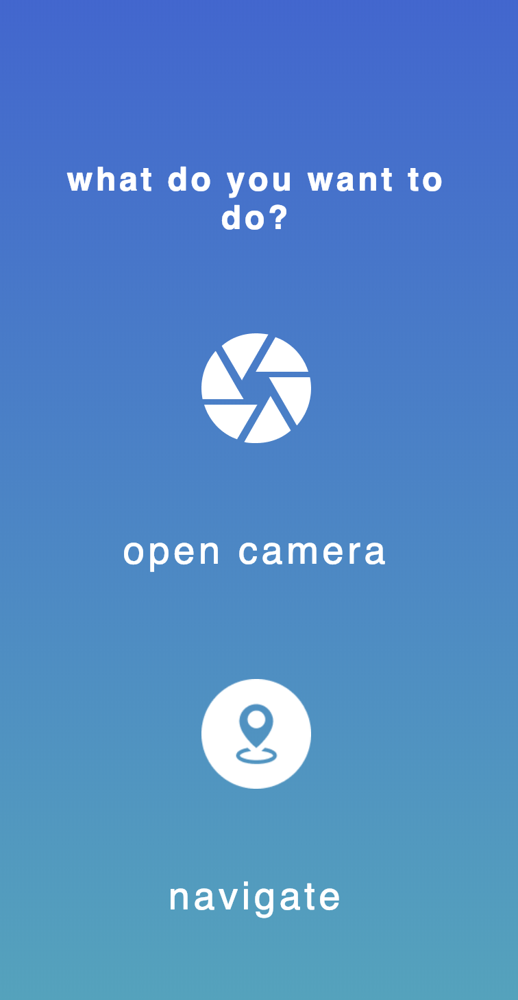
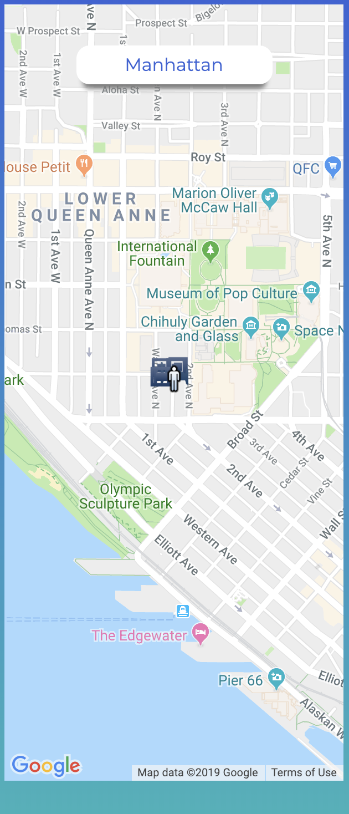

# HackWashington2k19

An application to deliver a meaningful audio experience to visually challenged people when they travel.
Uses JS Speech Recognition and Synthesis API.
Also, allows the user to use voice commands to take pictures and describe what is in the image.

